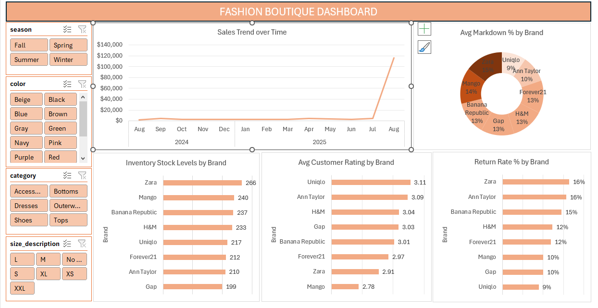

# FASHION_BOUTIQUE_POWER_QUERY_PROJECT
I used power query to clean data and pivort charts and a dashboard to analyze and visualize the data.

# Introduction
## Objective

The purpose of this analysis was to study how different factors influence sales of clothes and accessories in a fashion boutique,for a continuous period of time – from August 2024 to August 2025. From the analysis I was able to gain insights into the trend of sales and how different factors affect them. These factors include seasons, color of the item, category of the item and size of the item.

## The dataset contains a single table with the following fields
* product_id
* category
* brand
* season
* size
* color
* original_price
* markdown_percentage
* current_price
* purchase_date
* stock_quantity
* customer_rating	is_returned	return_reason
  
# Dataset Link
https://www.kaggle.com/datasets/pratyushpuri/retail-fashion-boutique-data-sales-analytics-2025

# Data Preprocessing
Data Cleaning: The data was checked for missing values, there were none. The data types of original_price and current_price were changed from text to currency, markdown_percentage and customer_ratings were changed from text to decimal numbers,stock quantity changed from text to whole number and date_purchased changed from text to date.
I added a custom column - calculated_price_confirmation - to confirm the current_price of the items. = [original_price] * (1-[markdown_percentage]/100)
I filtered out the null customer ratings.
I added column size_description so as to replace the null sizes with "No Size"

# KPIs
#### 1. Return Rate Analysis 
Calculate the overall percentage of returned items (where is_returned is True) and break it down by category, brand, color, or return_reason to identify patterns, such as common issues like "Size Issue" or "Quality Issue".
#### 2. Average Customer Rating by Category/Brand
Compute the mean customer_rating across all products, then segment it by category, brand, or season to assess customer satisfaction and highlight top-performing or underperforming areas.
#### 3. Markdown and Pricing Effectiveness 
Determine the average markdown_percentage and compare original_price to current_price to evaluate discount strategies, including their impact on stock movement or returns, grouped by season or brand.
#### 4. Inventory Stock Levels
Analyze average stock_quantity by category, size, or color to identify low-stock items (e.g., below a threshold) or overstocked products, helping with restocking decisions.
#### 5. Sales Trends Over Time
Group data by purchase_date (e.g., monthly or quarterly) to track trends in purchases, returns, or ratings, and correlate with season to reveal seasonal demand patterns.

# Data Analysis
Bar charts were used to compare data sets, for example, popular brands.
Pie charts were used to show the breakdown of data into sub parts.
Line charts were used to show the trend of variables over a given period of time.

# Dashboard

